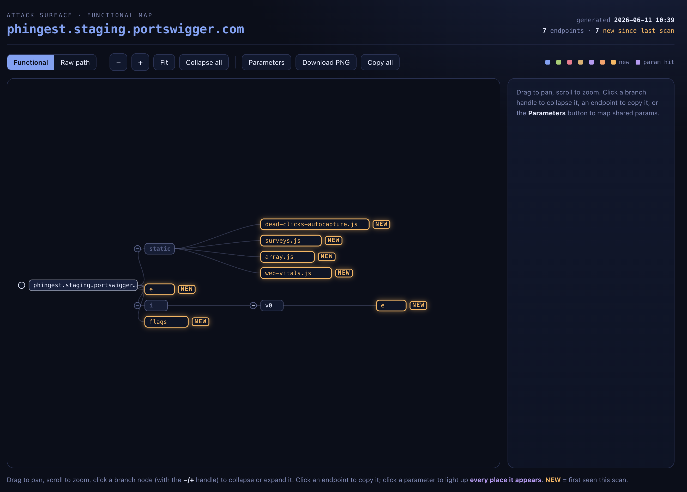

# Attack Surface Map – Burp Suite Extension

Passively maps the functional attack surface of a web application as you browse through Burp's proxy. Captures every in-scope endpoint, groups them visually by function using the app's own URL vocabulary, tracks parameters across the surface, and renders a pannable/zoomable map with full request/response viewer and PNG export.



## Screenshot


## Features

- **Passive capture** – records endpoints as you browse; no active scanning, no crawler
- **Scope-filtered** – only in-scope traffic (via Target → Scope) is recorded
- **Functional grouping** – color-coded by feature area, named from the app's own path segments (no hardcoded labels)
- **Version prefix stripping** – `/v1/transfers/send` shows as `transfers → send`
- **NEW highlighting** – endpoints first seen since last baseline are visually flagged
- **Parameter analysis** – click any parameter to highlight every endpoint that uses it
- **Request/response viewer** – full raw HTTP per endpoint, stacked view with scroll and copy
- **Project import/export** – portable `.json` files per engagement, merge across sessions
- **PNG export** – full-resolution diagram for reports

## Requirements

- Burp Suite 2022.9.5+ (Montoya API)
- Java 17+ (for building)
- Gradle 8+ (for building)

## Build

```bash
gradle wrapper
export JAVA_HOME=$(brew --prefix openjdk@17)/libexec/openjdk.jdk/Contents/Home  # macOS
./gradlew build
```

The output JAR is at `build/libs/surface-map.jar`.

## Install in Burp

1. Go to **Extensions → Installed → Add**
2. Set **Extension type** to **Java**
3. Select `build/libs/surface-map.jar`
4. Click **Next** — you should see "Surface Map loaded." in the Output tab and a new **Surface Map** tab in Burp

## Usage

1. Define your target in **Target → Scope**
2. In the **Surface Map** tab, tick **Capture (proxy, in-scope)**
3. Browse the target through Burp's proxy, opening every menu, tab, and screen
4. Click **Open map in browser** to view the visual map
5. Click **Set baseline** to mark the current state — future sessions highlight only new endpoints
6. Use **Export project** to save a `.json` file per engagement; **Import project** to reload or merge

## Project structure

```
src/main/java/io/github/surfacemap/
├── SurfaceMapExtension.java   # BurpExtension entry point + unload handler
├── SurfaceMapHandler.java     # HttpHandler (passive, proxy + scope filtered)
├── SurfaceMapModel.java       # Thread-safe data model + persistence + JSON parser
├── SurfaceMapTab.java         # Swing UI tab
└── HtmlRenderer.java          # Builds the self-contained HTML map
```

## License

MIT
